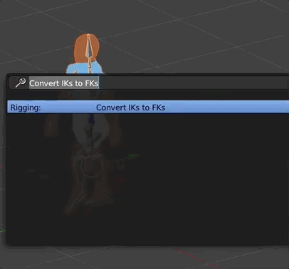

# Permanently Moved

This repository contains versions at and before `2.0.3`.

All versions after that live in the [landon repository](https://github.com/chinedufn/landon).


---
---
---
---
---
---
---
---
---
---
---
---
---
---
---
---
---
---
---
---
---
---
---
---
---
---
---
---
---
---
---
---
---
---
---
---
---
---
---
---
---
---
---
---
---
---
---
---
---
---
---
---
---
---
---
---
---
---
---
---
---
---
---
---
---
---
---
---
---
---
---
---
---
---
---
---
---
---
---
---
---
---
---
---
---
---
---
---
---
---
---
---
---
---
---
---
---
---
---
---
---

blender-iks-to-fks [](http://badge.fury.io/js/blender-iks-to-fks) [](https://dev.azure.com/frankienwafili/blender-iks-to-fks/_build/latest?definitionId=1&branchName=master)
===========

> A Blender Addon that takes a mesh and armature that use IKs and other non-deformation bones and
creates a new mesh and armature that uses only FK bones.



## Background / Initial motivation

I wrote a post a few months ago about [converting IKs and constraints into FKs in Blender](http://chinedufn.com/blender-export-iks-constraints/).
The process was manual, tedious and very error prone. To the point where I would push of and procrastinate rigging because I dreaded the IK -> FK conversion.

This script automates the IK / Constraint bones -> FK bones conversion process.

It does this by generating a new mesh and FK rig that copy the animations of your original mesh and rig, but without the IK / Constraints.

---

I wrote a [reddit comment attempting to explain IK vs FK at a five year old level](https://www.reddit.com/r/blender/comments/6k4dou/open_source_blender_addon_to_automatically/djjaqcc/).

## Benefits

- Unlike `Bake Action`, `blender-iks-to-fks` **does not create any additional keyframes**
- Your original mesh remains unmodified, preventing you from accidentally losing / overwriting your work

## Supported Blender Versions

We currently support `Blender 2.80` as of `blender-iks-to-fks v2.0.0`.

For `Blender 2.79` support use the `1.3.4`

## Install

There are two ways to install the addon into Blender.

1. By running a script
2. OR by manually downloading and adding it into Blender

### Install via script

This method requires that Blender is added to your $PATH

```sh
# This installs the script in Blender and saves it to your user preferences
npm install -g blender-iks-to-fks && ik2fk --install
```

### Manual Download Instructions

[Manual installation instructions](manual-installation-instructions.md)

## Usage

`blender-iks-to-fks` will delete all non-deformation bones when creating your rig, so be sure to uncheck `use deform` for your IK and control bones.
You can do this in the `Bone` panel while in `Edit Mode`.


### In Blender Window:

1. Select your mesh in Object Mode
2. Press Space
3. Search for 'Convert IKs to FKs' and select it
4. You should now have a new mesh and armature that use FKs

### Via Blender CLI

You can run this addon via the Blender CLI as part of an automated conversion process. Here's how:

```sh
blender my-blender-file.blend --python `ik2fk`
```

### Via bpy.ops

You can run this addon in the Blender Python Console or via any python script by running

```sh
bpy.ops.rigging.iktofk()
```

If the currently active object (`bpy.context.active_object`) is an armature then `blender-iks-to-fks` will run on that
armature. Otherwise it will run on the first armature that it finds in your Blender scene.

You can convert multiple armatures by iterating over them, setting them at the active object and then calling `bpy.ops.rigging.iktofk()`

### ik2fk CLI

```sh
Usage

  $ ik2fk
    # Returns the filename of the Blender addon. Useful for running the addon via CLI
    # i.e.
    #   blender my-model.blend --python `ik2fk`

  $ ik2fk --help
    # Prints some help text on how to use this command

  $ ik2fk --install
    # Installs and enables the addon and then saves it to your Blender user preferences
    # Note that you must have Blender in your $PATH in order for this command to work
    #
    # You can also follow instructions to install it manually https://github.com/chinedufn/blender-iks-to-fks#install

Options

  -h, --help            -> Get help text about using the blender-iks-to-fks CLI

  -i, --install-blender -> Install the addon and save it in your Blender
```

## Running Tests

```sh
npm run test
```

## Have an idea? Confused?

Open an issue and lets sort it out!

## See Also

- [Landon](https://github.com/chinedufn/landon) - tooling for exporting data from Blender such as meshes and armatures.

## License

(c) 2017 Chinedu Francis Nwafili. MIT License
