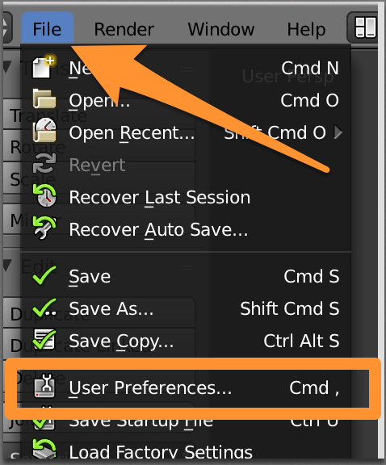
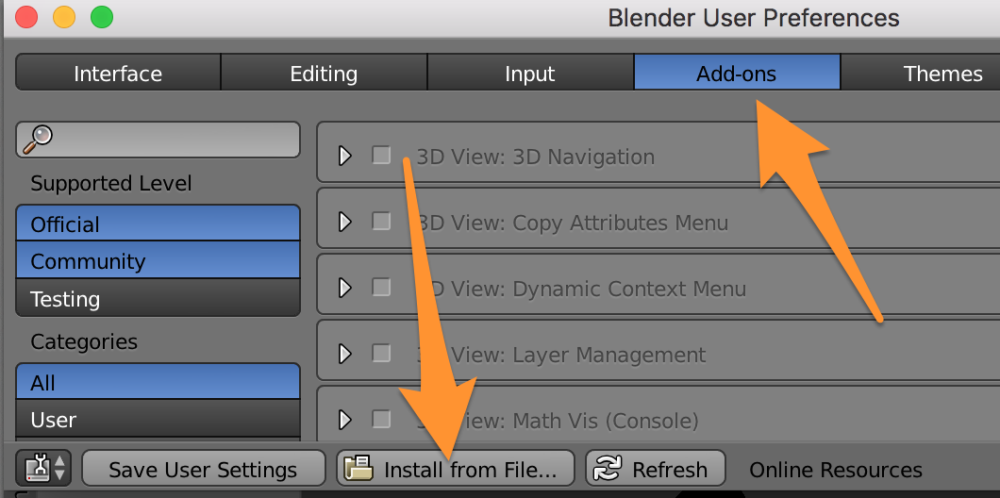
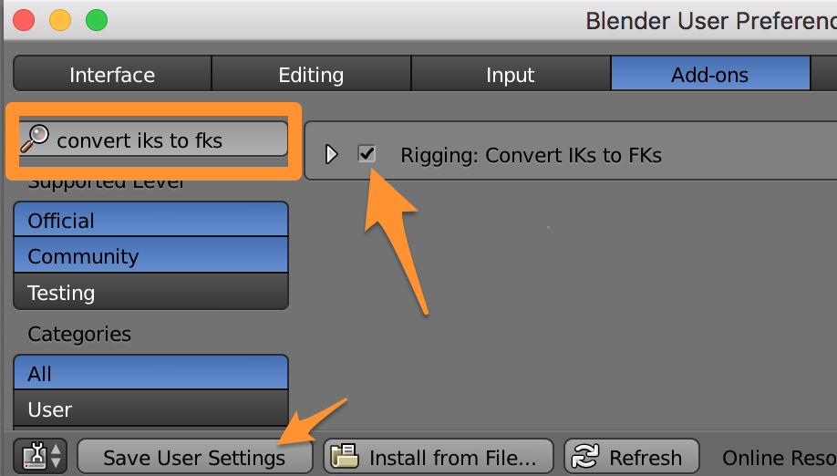

[Download the Addon file](https://github.com/chinedufn/blender-iks-to-fks/releases/download/2.0.0/convert-ik-to-fk.py)

Go to your user preferences in Blender

Install the Blender Addon file that you just downloaded

Save the Addon so that it is enabled the next time you use Blender

