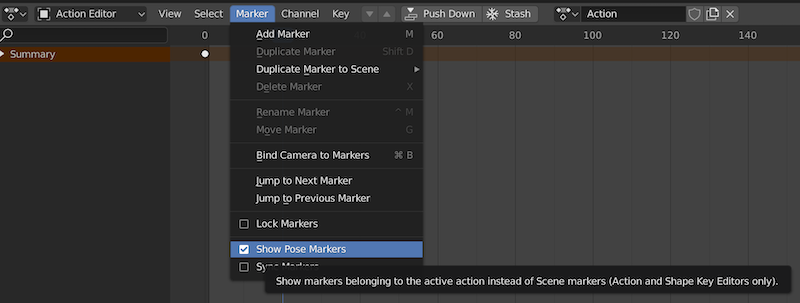

# Pose Markers

Each action's [pose markers] are exported.

One example use case is to have your application trigger a sound whenever a frame that has a
pose marker called "Foot Contact" is crossed.

Note that there is a difference between pose markers and scene markers. Make sure to `Show Pose Markers`
before attempting to create a pose marker.

[pose markers]: https://docs.blender.org/manual/en/latest/animation/markers.html
