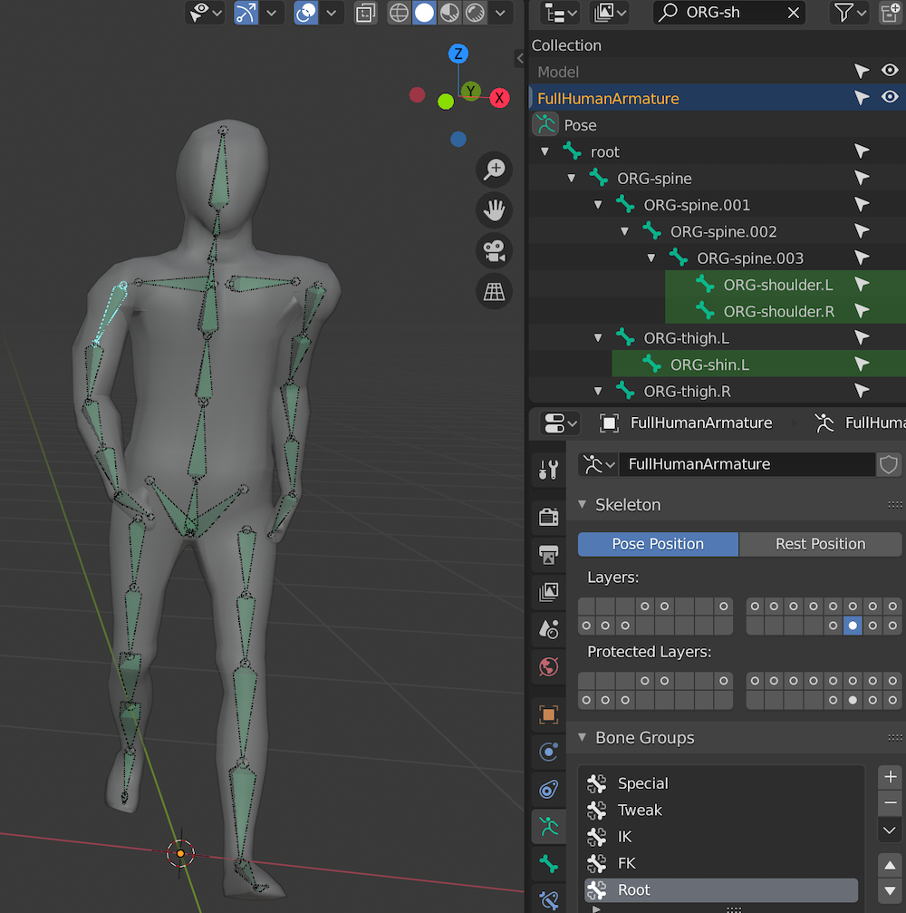

# Troubleshooting Rigify

- Armature layer with these bones are hidden by default, make sure to enable (screenshot)
- Copy transforms constraint from shoulder.L to ORG-shoulder.L
- Copy transforms constraint from shoulder.R to ORG-shoulder.R
- Copy transforms constraint from pelvis.L to ORG-pelvis.L
- Copy transforms constraint from pelvis.R to ORG-pelvis.R

- Action item: Open issue in the rigify repository asking if these constraints can be added by default

