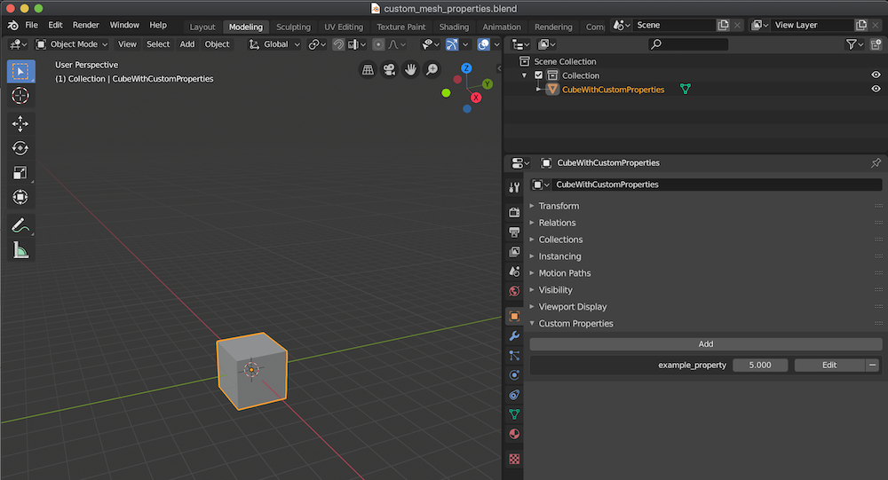

# Custom Properties

`landon` exports all [custom properties][custom-properties-rust-api] found on a mesh.

These can be useful when your application code wants to treat certain meshes differently based on certain
properties that you label the mesh with in Blender.

For example - you might have a linter that ensures that none of your meshes go above 200 vertices in order
to preserve your low poly art style.

There might be some exceptions to this rule - so your code might check for the `override_max_vertex_count`
custom property to enforce a different limit in special cases.

In Blender custom properties these can be added in the Object section of the Context panel.

### Rust API

[Rust API][custom-properties-rust-api]

[custom-properties-rust-api]: https://docs.rs/blender-mesh/latest/blender_mesh/struct.BlenderMesh.html#method.custom_properties
